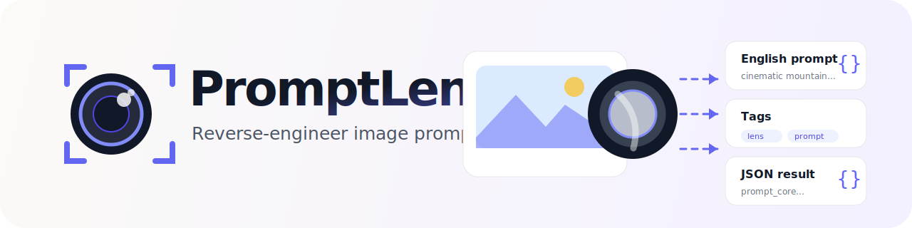
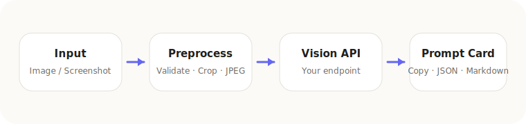
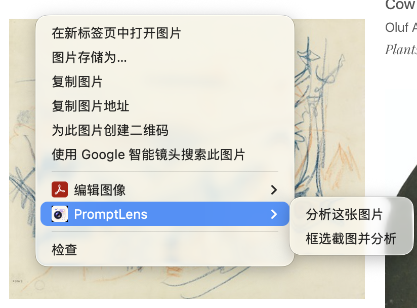
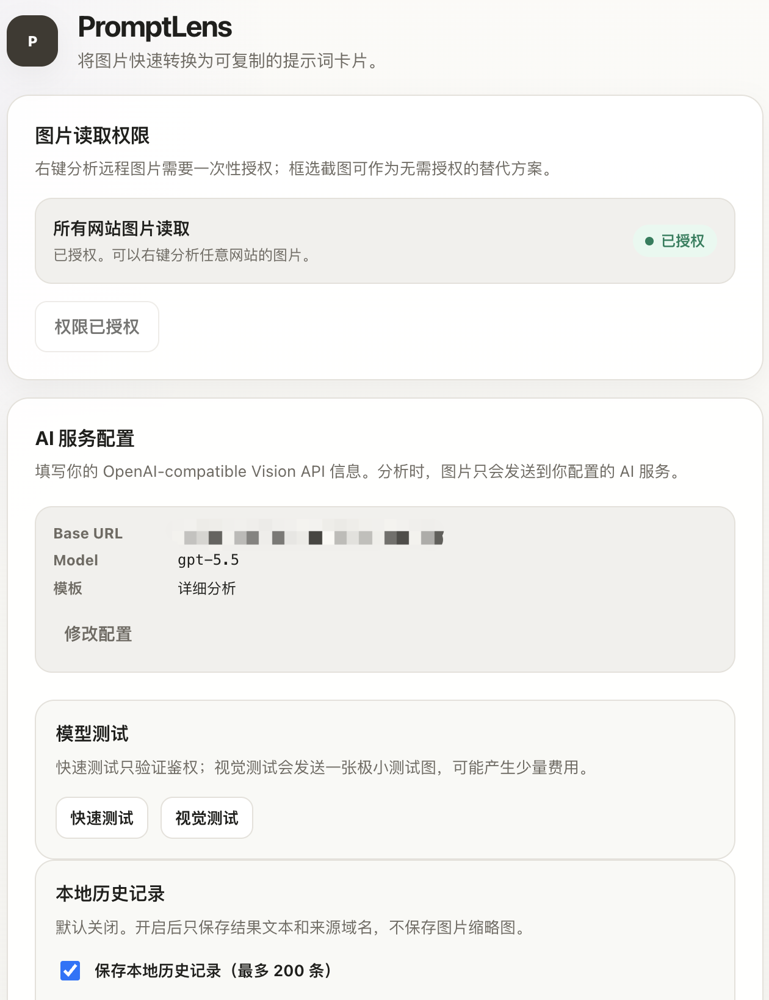
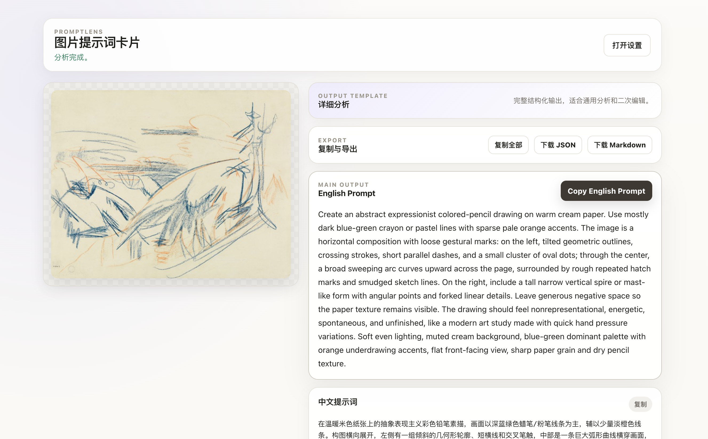

# PromptLens

<p align="center">
  
</p>

<p align="center">
  Reverse-engineer image prompts from any web image or selected screenshot region.
</p>

<p align="center">
  English · <a href="./README.zh-CN.md">简体中文</a> · <a href="./README.zh-TW.md">繁體中文</a>
</p>

<p align="center">
  
  
  
  
</p>

PromptLens is a lightweight Chrome MV3 extension that sends a web image or a selected screenshot region to your own OpenAI-compatible Vision API and generates reusable reverse image prompts.

Its goal is to stay simple, transparent, and self-hosting-friendly: no login, no payment system, no built-in backend, and no lock-in to a specific model provider.

## Features

- **Right-click image analysis**: right-click a web image and generate reverse image prompts.
- **Selection screenshot analysis**: select a visible page region for `blob:` images, hotlink-protected images, or remote images without host permission.
- **Bring your own model service**: configure AI Base URL, API Key, and Model.
- **OpenAI-compatible Vision API**: uses the `/chat/completions` style vision request format.
- **Structured results**: Chinese prompt, English Prompt, Tags, Negative Prompt, JSON Prompt, and Raw JSON.
- **Professional prompt variants**: generates recreate, creative extension, and commercial visual prompt cards for professional design workflows.
- **Built-in output templates**: Detailed Analysis, Natural Language, Weighted Tags, and Quick Copy.
- **Custom templates**: copy built-ins, create, edit, delete, import, and export custom templates.
- **Provider presets**: OpenAI, DeepSeek, Alibaba, SiliconFlow, Groq, OpenRouter, Ollama, and Custom.
- **Keyboard selection shortcut**: `Alt+Shift+S` starts screenshot selection; users can change it at `chrome://extensions/shortcuts`.
- **Optional local history**: off by default; stores text results, source domain, original image URL, page URL, and template metadata. No image thumbnails are saved.
- **Result export**: copy individual fields, copy all, download JSON, and download Markdown.
- **Local-first**: configuration stays in the browser; there is no remote account system.
- **Frontend-only**: no npm dependencies, no build step, and no backend service.

## Non-goals

PromptLens intentionally does not include:

- Login / OAuth
- Payment / quota system
- Built-in cloud service / Supabase
- Cloud history sync
- Auto-fill into third-party generation websites
- Team collaboration or account sync

## How it works

1. The user right-clicks a web image or starts screenshot selection.
2. The extension reads an image URL, data URL, or current-tab visible screenshot.
3. The image is validated, cropped, compressed, and normalized to JPEG locally.
4. The result page calls the user-configured OpenAI-compatible Vision API with the selected template.
5. The model returns JSON; the result page renders it and provides copy / JSON / Markdown export.

PromptLens does not provide a built-in model service. You need your own API service that supports vision input.

<p align="center">
  
</p>

## Installation

### Load from source

1. Download or clone this repository.
2. Open Chrome.
3. Go to `chrome://extensions`.
4. Enable **Developer mode**.
5. Click **Load unpacked**.
6. Select the repository root directory.

### Chrome Web Store

Not published yet. A Chrome Web Store link will be added here when available.

## Configuration

1. Open the extension options page from Chrome extension details.
2. Fill in:
   - **AI Base URL**: for example `https://api.openai.com/v1`.
   - **API Key**: your model service key.
   - **Model**: a model name that supports vision input.
   - **Default output template**: Detailed Analysis, Natural Language, Weighted Tags, or Quick Copy.
3. Click **Save settings**.
4. To right-click analyze remote images from any website, click **Grant image read permission**.

Notes:

- AI Base URL must use HTTPS.
- Local development may use `http://localhost` or `http://127.0.0.1`.
- If you do not grant all-sites image read permission, you can still use screenshot selection.

## Usage

### Analyze a web image

1. Right-click a web image.
2. Choose **Analyze this image**.
3. A new result tab opens and shows progress.
4. Copy the prompt you need after analysis completes.

If the page reports missing image read permission, grant permission in options or use screenshot selection.

### Analyze a selected screenshot region

1. Right-click anywhere on a page.
2. Choose **Select screenshot and analyze**.
3. Drag to select the visible region.
4. Wait for the result page to generate prompts.

Press Esc or click Cancel to exit selection mode.

## Screenshots

| Context menu | Options |
| --- | --- |
|  |  |

| Result |
| --- |
|  |

## Privacy and security

PromptLens has a simple privacy boundary:

- API Key is stored locally in `chrome.storage.local`.
- Images are sent only to the AI Base URL you configure.
- The extension has no backend service and collects no telemetry.
- Local history is off by default; when enabled, it stays in the browser, saves source image/page URLs for history recall, and does not save image thumbnails. It may save generated prompt text, including professional prompt variants that describe visible people, brands, products, scenes, or commercial visual details inferred from the image.
- Remote image read permission is optional and is not requested at install time.
- Screenshot selection uses `activeTab` and only accesses the current tab after user action.

When using a third-party model service, images and prompts are sent to that service. Review the provider's privacy policy, retention policy, and terms yourself.

Professional prompt variants are model-generated text suggestions, not official parameters or guaranteed best practices for any third-party generation platform. When you paste prompts into another tool, that tool's privacy, billing, copyright, and content policies apply.

See [SECURITY.md](SECURITY.md) for more details.

## Permissions

Permissions used in `manifest.json`:

- `contextMenus`: create right-click menus.
- `storage`: store model config, current template, local history settings, and temporary input.
- `activeTab`: access the current tab when the user starts screenshot selection.
- `scripting`: inject screenshot selection script and style.
- `commands`: register the screenshot selection shortcut.
- `optional_host_permissions: ["<all_urls>"]`: request remote image read permission and API origin access only when needed.

## Supported image formats

- Supported: PNG, JPEG, WebP.
- Not supported: SVG.
- Not directly readable: `blob:` images. Use screenshot selection instead.
- Remote image file size limit: 20MB.
- Images are normalized to JPEG before sending to the model.

## Development

This project intentionally stays simple:

```text
manifest.json      Chrome MV3 manifest
background.js      Context menus, screenshot capture, temporary payload handoff
content.js         In-page screenshot selection interaction
selection.css      Screenshot selection styles injected into web pages
options.html/js    Options page
history-store.js   Local history IndexedDB helper
history.html/js    Local history page
templates.js       Built-in / custom templates and fixed JSON output schema
result.html/js     Result page, export, history save, and model calls
styles.css         Options and result page styles
```

Local checks:

```bash
node --check background.js
node --check content.js
node --check templates.js
node --check history-store.js
node --check history.js
node --check options.js
node --check result.js
```

Development principles:

- No build tools.
- No npm dependencies.
- No remote resources.
- Keep Vanilla JavaScript / CSS.
- Keep new features local-first and privacy-transparent.

## Roadmap status

The current branch has implemented v0.3.1: built-in / custom templates, provider presets, keyboard shortcut, result export, model tests, token usage, optional local history, basic i18n, and Chrome Web Store preparation.

Future feedback-driven directions:

- More complete English / Traditional Chinese UI translation.
- Firefox MV3 compatibility research.
- Continue tuning image preprocessing defaults based on real feedback.

## Contributing

Issues and pull requests are welcome. Please read [CONTRIBUTING.md](CONTRIBUTING.md) first.

## License

MIT License. See [LICENSE](LICENSE).
